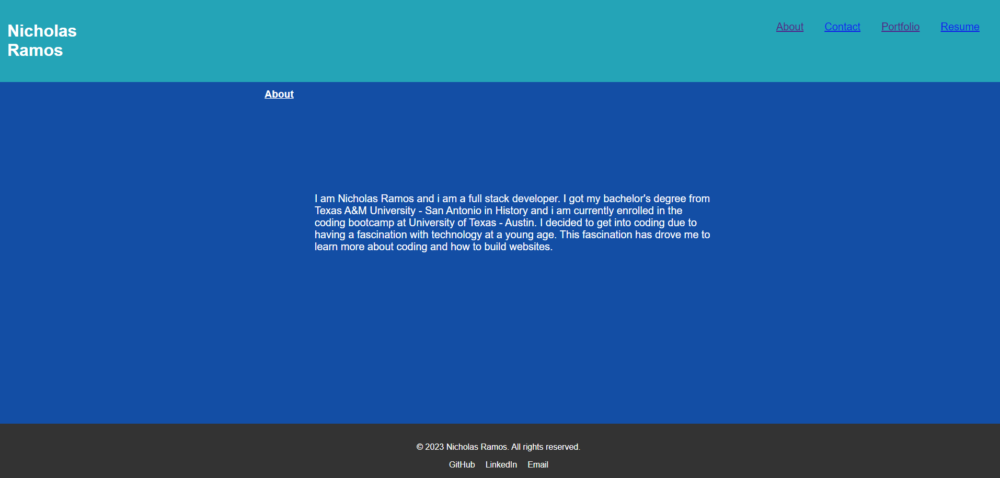
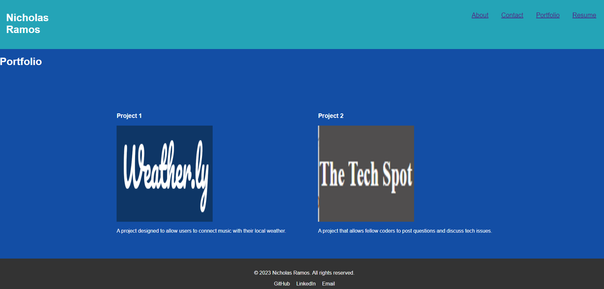
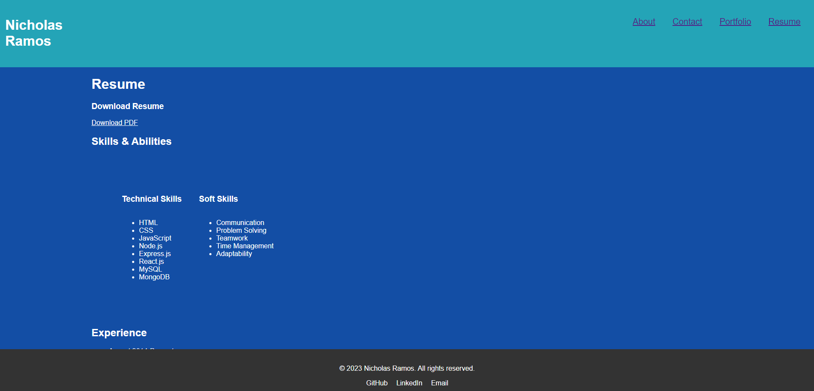

# Nick's Portfolio

## Table of Contents
* [Description](#description)
* [Github](#github)
* [Deployed_Page](#deployed-page)
* [Website_Screenshots](#website-screenshots)
* [Installation](#installation)
* [Usage](#usage)
* [License](#license)
* [Contributing](#contributing)

## Description

A portfolio using React that shows off my most recent projects.

## Github
 

* Link to Github: https://github.com/nramos9071/challenge-20

## Deployed Page

https://thunderous-gnome-19640b.netlify.app

## Website Screenshots

## Installation
React,
Vite,

 
## Usage
A website designed to showcase my most recent projects/
 
## License
N/A
 
## Contributing
Code Created by: Nick Ramos with code contributed by CoPilot.

